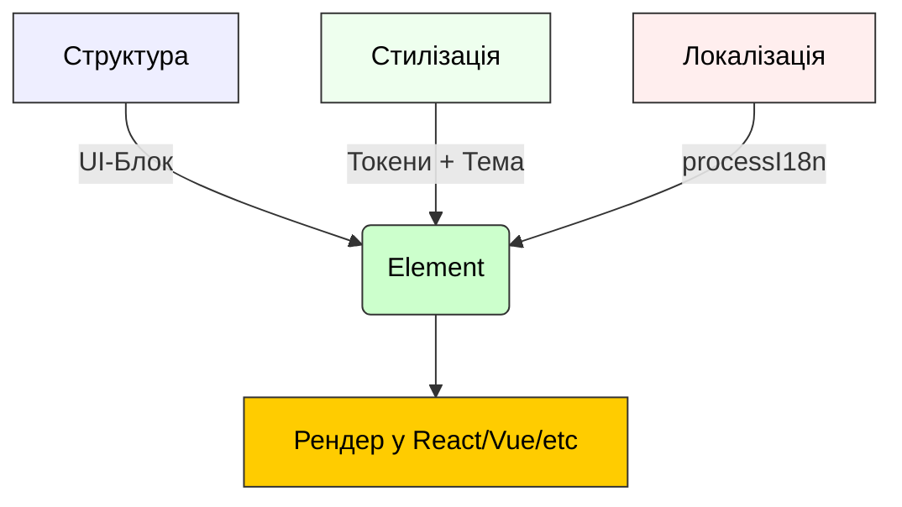
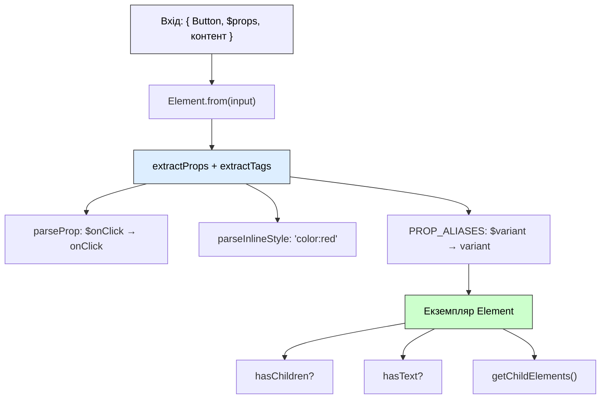
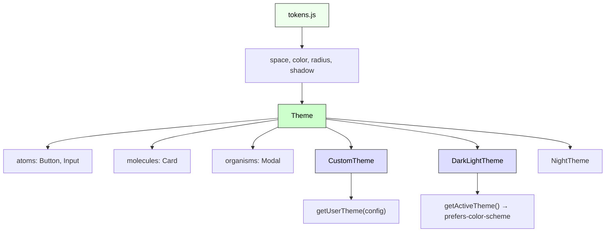

# @nan0web/ui-core

|[Статус](https://github.com/nan0web/monorepo/blob/main/system.md#написання-сценаріїв)|Документація|Покриття тестами|Функції|Версія Npm|
|---|---|---|---|---|
|🟢 `99.4%`|🧪 [Англійською 🏴󠁧󠁢󠁥󠁮󠁧󠁿](https://github.com/nan0web/ui-core/blob/main/README.md)<br />[Українською 🇺🇦](https://github.com/nan0web/ui-core/blob/main/docs/uk/README.md)|🟢 `98.0%`|✅ d.ts 📜 system.md 🕹️ playground|—|

Бібліотека для створення UI-елементів, незалежних від фреймворків.
Дозволяє описувати інтерфейси як прості об'єкти.

## Опис

Пакет `@nan0web/ui-core` надає мінімальний, але потужний фундамент для
UI-елементів, незалежних від фреймворків. Він призначений для опису
інтерфейсів як декларативних об'єктів. Основні класи та утиліти:

- `Element` — основний клас для представлення UI-елементів.
- `processI18n` — утиліта для перекладу та підстановки змінних у контенті.
- `tokens` — токени дизайн-системи для узгодженого оформлення UI.
- `Theme` — базовий клас для створення та організації UI-тем.
- `getUserTheme` — функція для вибору або створення власної теми.

Це ідеально підходить для побудови дизайн-систем, тематичних UI-фреймворків
та бібліотек компонентів, які можна повторно використовувати.

## Встановлення

Як встановити через npm?
```bash
npm install @nan0web/ui-core
```

Як встановити через pnpm?
```bash
pnpm add @nan0web/ui-core
```

Як встановити через yarn?
```bash
yarn add @nan0web/ui-core
```

## Використання

### Створення базового елемента

Елементи можна створювати з типом компонента, контентом та властивостями.

Як створити екземпляр базового Element з об'єкта?
```js
import Element from '@nan0web/ui-core'
const element = new Element({
  Button: ["Натисни мене"],
  $variant: "primary"
})
console.info(element.type)    // "Button"
console.info(element.content) // ["Натисни мене"]
console.info(element.props)   // { variant: "primary" }
```
### Вкладені елементи

Елементи можуть включати дочірні елементи у вигляді масивів.

Як створити вкладені елементи і перевірити hasChildren()?
```js
import Element from '@nan0web/ui-core'
const element = new Element({
  div: [
    { span: "Привіт, світ!" },
    { Button: ["Підтвердити"] }
  ],
  $style: "color: blue; margin: 10px"
})
console.info(element.hasChildren()) // true
console.info(element.getChildElements().length) // 2
```
### Aria атрибути

Element обробляє `$aria*` властивості та перетворює їх на `aria-*` атрибути.

Як обробляються Aria атрибути, наприклад, `$ariaLabel`?
```js
import Element from '@nan0web/ui-core'
const element = new Element({
  button: "Закрити",
  $ariaLabel: "Закрити діалог"
})
console.info(element.props) // { "aria-label": "Закрити діалог" }
```
### Обробники подій

Element визначає `$on*` властивості як обробники подій.

Як обробляти події, такі як `$onClick` і `$onKeyDown`?
```js
import Element from '@nan0web/ui-core'
const handleClick = () => console.log("Клікнуто")
const element = new Element({
  button: "Натисни мене",
  $onClick: handleClick,
  $onKeyDown: () => {}
})
console.info(typeof element.props.onClick)
console.info(typeof element.props.onKeyDown)
```
## i18n (Багатомовність)

Елементи підтримують переклади та заміну змінних із утилітою `processI18n`.

Як виконати переклад за допомогою `processI18n` та `$t`?
```js
import { processI18n } from '@nan0web/ui-core'
const input = { $t: "greetings.hello" }
const t = (key) => key === "greetings.hello" ? "Привіт!" : key
const result = processI18n(input, t)
console.info(result) // "Привіт!"
```

Як підставити змінні в текстовому контенті через `processI18n`?
```js
import { processI18n } from '@nan0web/ui-core'
const text = "Користувач: {{name}}, Вік: {{age}}"
const data = { name: "Іван", age: "30" }
const result = processI18n(text, null, data)
console.info(result) // "Користувач: Іван, Вік: 30"
```
## Пісочниця: Спробуй перед тим, як використовувати

Існує CLI-пісочниця для безпечних експериментів:

```bash
git clone https://github.com/nan0web/ui-core.git
cd ui-core
npm install
npm run playground
```

## Документація API

### Клас Element



* **Властивості**
  * `type` – тип компонента або HTML-тег (наприклад, "Button", "div").
  * `content` – контент елемента (текст, масив або вкладені елементи).
  * `props` – вилучені властивості з розширеними `$`-ключами.

* **Методи**
  * `hasChildren()` – повертає true, якщо елемент містить вкладені елементи.
  * `hasText()` – повертає true, якщо контент включає текст.
  * `getChildElements()` – повертає масив дочірніх елементів.
  * `static from(input)` – створює або повертає існуючий елемент `Element`.

* **Статичні властивості**
  * `PROP_ALIASES` – мапа альтернативних ключів (наприклад, `$class` для `className`).

* **Статичні методи**
  * `parseProp()` – перетворює `$`-властивості в стандартну форму.
  * `parseInlineStyle()` – перетворює CSS-рядок в об'єкт стилів.
  * `extractProps()` – вилучає всі властивості з префіксом `$`.
  * `extractTags()` – вилучає ключі без префікса як `[type, content]`.



Як створити `Element` з комплексним контентом?
```js
import Element from '@nan0web/ui-core'
const element = new Element({
  div: [
    "Текстовий контент",
    { span: "Вкладений елемент" }
  ],
  $className: "container",
  $onClick: () => {}
})
console.info(element.type)         // "div"
console.info(element.hasText())    // true
console.info(element.hasChildren()) // true

```
### Утиліта processI18n

* **Параметри**
  * `input` – вміст для перекладу чи підстановки.
  * `t` – опціональна функція перекладу.
  * `data` – опціональний об'єкт підстановки змінних.

* **Повертає**
  * оброблений контент (рядок, масив або незмінений тип).

Як використовувати `processI18n` з масивами?
```js
import { processI18n } from '@nan0web/ui-core'
const content = [
  "Ім’я: {{name}}",
  { $t: "welcome" },
  [{ $t: "nested" }]
]
const t = (key) => key === "welcome" ? "Ласкаво просимо" : "Nested"
const data = { name: "Іван" }
const result = processI18n(content, t, data)
console.info(result) // ["Ім’я: Іван", "Ласкаво просимо", ["Nested"]]

```
## Теми

Теми будуються за допомогою атомів, молекул та організмів.


Як отримати доступ до токенів теми?
```js
import { tokens } from '@nan0web/ui-core'
console.info(tokens.color.primary) // "var(--color-primary)"
console.info(tokens.font.size.base) // "1rem"
```
### Власні теми

Створення власної теми через `getUserTheme`.

Як створити власну тему з `getUserTheme`?
```js
import { getUserTheme } from '@nan0web/ui-core'
const theme = getUserTheme({
  atoms: { Button: { background: "red" } },
  color: { background: "#fff" }
})
console.info(theme.atoms.Button.background) // "red"
```
### DarkLightTheme

Тема автоматично перемикається між темною та світлою.

Як перевірити активну тему в `DarkLightTheme`?
```js
import { DarkLightTheme } from '@nan0web/ui-core'
DarkLightTheme.current = "light"
const theme = DarkLightTheme.getActiveTheme()
console.info(theme) // { background: "#fff", text: "#000" }

```
## Java•Script

Використовує `.d.ts` файли для автозавершення

## Допомога у розробці

Як допомогти? — [перегляньте тут](./CONTRIBUTING.md)

## Ліцензія

Як ISC ліцензія? — [перегляньте тут](./LICENSE)
