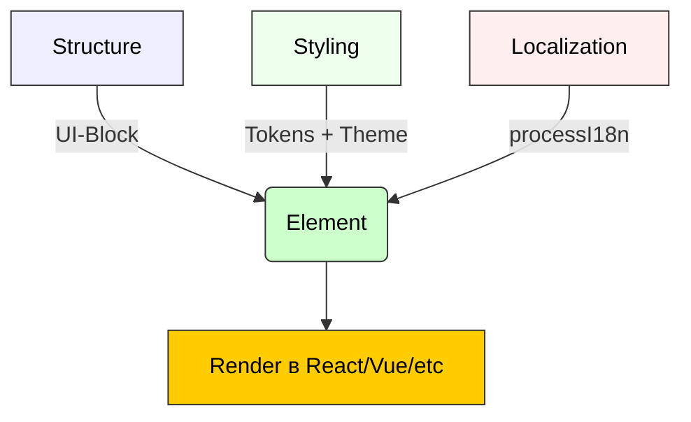
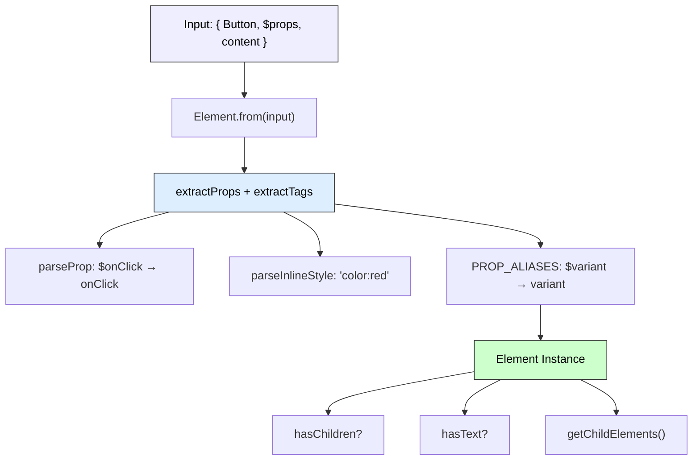
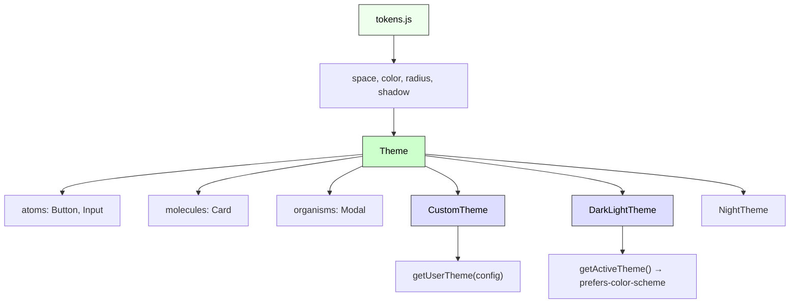

# 🧱 Інструкція для `@nan0web/ui-core`  
**українською мовою**, на основі наданого контексту,  
з фокусом на **файл → тест → принцип** і **доведеність об’єктів знання**.

---

## 📌 Що таке `@nan0web/ui-core`?

Це **агностичне ядро UI** для `nan0web` —  
без залежності від React, Vue чи іншого фреймворку.  
Воно визначає:

- Як виглядає **UI-блок** (наприклад, `{ Button: ["Натисни"], $variant: "primary" }`)
- Як парсити `$`-пропси (`$onClick`, `$style`, `$ariaLabel`)
- Як працювати з темами, стилями, i18n
- Як уніфікувати UI-елементи між платформами

> UI — це не про екрани.  
> Це — про **структуру наміру**.

---

## 🔧 Основні компоненти пакета

### 🌀 Верхній рівень абстракції (Core Layers)



> **Пояснення рівнів**:
> - **Structure**: `{ Button: ['OK'], $onClick: fn }` → `Element`
> - **Styling**: `tokens` → `Theme` → `Button.style`
> - **Localization**: `{$t: 'key'}` → текст, `{{name}}` → заміна

### 1. `Element` — модель блоку
**Файл**: `types/Element.d.ts`, `src/Element.js`

### 🔍 2. Деталізація: `Element` — Ядро структури



#### Концепція
UI-блок — це **об’єкт із тегом і $-пропсами**:
```js
{ Button: ["Зберегти"], $onClick: save, $variant: "success" }
```

- Ключ (`Button`) → тип елемента
- Значення (`["Зберегти"]`) → вміст
- `$`-пропси → атрибути (onClick, style, aria-*, className)

#### Методи
- `Element.from(input)` — створює екземпляр
- `element.hasChildren()` — чи є вкладені елементи
- `element.hasText()` — чи є текст у вмісті
- `element.getChildElements()` — масив вкладених `Element`

#### Парсинг
- `Element.parseProp('$onClick', fn)` → `{ onClick: fn }`
- `Element.parseInlineStyle("color:red;font-size:14px")` → `{ color: 'red', fontSize: '14px' }`
- `Element.extractProps(block)` → видобуває всі `$`-пропси
- `Element.extractTags(block)` → видобуває компоненти (`Button`, `div` тощо)

> Мета: **декларативний UI, зрозумілий без JSX**.

---

### 2. `Theme` — основа стилів
**Файл**: `types/theme/Theme.d.ts`



#### Концепція
Універсальна модель теми — не CSS-in-JS, а **об’єкт налаштувань**:
```js
class Theme {
  static atoms = { Button: { borderRadius: '8px' } }
  static molecules = { Card: { padding: '16px' } }
  static organisms = { Modal: { overlayBackground: 'rgba(0,0,0,0.5)' } }
}
```

- `atoms` — базові компоненти (Button, Input)
- `molecules` — композиції (Card, Form)
- `organisms` — складні структури (Modal, Header)

> Це **не стан**, а **вибір форми в момент пробудження**.

---

### 3. `CustomTheme`, `DarkLightTheme`, `NightTheme`
**Файл**: `types/theme/CustomTheme.d.ts`, `DarkLightTheme.d.ts`, `NightTheme.d.ts`

#### `CustomTheme`
- Дозволяє створити тему з конфігу:
```js
new CustomTheme({ atoms: { Button: { background: 'blue' } } })
```

#### `DarkLightTheme`
- Автоматично перемикає тему за `prefers-color-scheme`
- `static getActiveTheme()` — повертає активну тему

#### `NightTheme`
- Темна тема з високим контрастом
- Перевизначає `solid`-кольори кнопок

---

### 4. `tokens` — дизайн-система
**Файл**: `types/tokens.d.ts`

Централізовані значення:
```js
tokens.space.md     // "16px"
tokens.radius.lg    // "12px"
tokens.color.text   // "#111"
tokens.shadow.md    // "0 4px 6px rgba(0,0,0,0.1)"
```

> Використовується усіма темами — єдина точка істини.

---

### 5. `processI18n` — обробка перекладів
**Файл**: `types/utils/processI18n.d.ts`

#### Функції
- `processI18n(input, t, data)`
- Підтримує:
  - `{ $t: "greetings.hello" }` → `"Привіт!"`
  - `"User: {{name}}"` → підстановка з `data`
  - Масиви, об’єкти, вкладені блоки

#### Приклад
```js
processI18n({ $t: "actions.save" }, key => translations[key])
// → "Зберегти"
```

> I18n — це не опція. Це **частина UI-наміру**.

---

## 🧪 Тестування

### 1. Основні команди
```bash
pnpm test                     # запуск усіх тестів
pnpm test:coverage            # покриття + zero-copy валідація
pnpm test:docs                # виконання прикладів у README.md.js як тестів
pnpm playground               # запуск демонстрації
```

### 2. Покриття
- `node --experimental-test-coverage --test-coverage-include="src/**/*.js"`
- Вимога: **≥ 90%**

### 3. `playground/main.js`
- Локальна демонстрація:
  - Створення `Element`
  - Парсинг стилів, i18n
  - Вкладені блоки
- Не встановлює залежності — працює з `node`

> Playground — **не для прикраси, а для перевірки на місці**.

---

## 📄 Документація

### 1. `src/README.md.js`
- Це **сценарій**, який:
  - Описує, як використовувати
  - Містить приклади
  - Кожен приклад **виконується як тест**
- Автоматично генерує:
  - `./README.md` (англійською)
  - `.datasets/README.jsonl` (LLM-ready)

### 2. Переклади
- `docs/uk/README.md` — переклад LLM-ом
- Структура валідується: заголовки, приклади, лінки — мають бути однакові

> Доверена документація = **кожен приклад — тест**.

---

## 🏗 Архітектура пакета

```
@nan0web/ui-core/
├── src/
│   ├── Element.js           # реалізація
│   ├── utils/
│   │   └── processI18n.js   # i18n
│   └── README.md.js         # динамічна документація
├── types/
│   ├── Element.d.ts
│   ├── theme/
│   │   ├── Theme.d.ts
│   │   ├── CustomTheme.d.ts
│   │   ├── DarkLightTheme.d.ts
│   │   └── presets/
│   ├── tokens.d.ts
│   └── utils/
│       └── processI18n.d.ts
├── playground/
│   └── main.js              # CLI демо
├── system.md                # система інструкцій (укр.)
└── package.json             # скрипти, peer deps, files
```

---

## ✅ Принципи `nan0coding`, що дотримується цей пакет

| Принцип                     | Реалізація у `ui-core` |
|-----------------------------|------------------------|
| **Ідея**                    | UI-блок як намір, а не компонент |
| **Архітектура**             | `Element`, `Theme`, `tokens` — окремі, логічні шари |
| **Тести на кожен фрагмент** | `*.test.js`, `test:coverage` |
| **Документація з коду**     | `src/README.md.js` → `README.md` + `.jsonl` |
| **Локалізація**             | `processI18n`, переклад через LLM |
| **Фізичний артефакт**       | `release.json`, `v1.0.0.jsonl` |
| **Репродуковність**         | `playground/main.js`, `db-fs` для тестів |

---

## 🔗 Як інтегрується з іншими пакетами?

- `@nan0web/ui-react` — використовує `Element` для рендера
- `@nan0web/db` — зберігає теми, налаштування
- `@nan0web/types` — базові типи
- `@nan0web/test` — тести та покриття
- `@nan0web/release` — контроль версій

---

## 📜 Системні вимоги (з `system.md`)

1. **Мова інструкцій** — українська
2. **Кожен фрагмент** повинен мати:
   - реалізацію в `src/`
   - тест в `src/**/*.test.js`
   - пояснення в `system.md` чи `README`
3. **Тести = доказ** — без тесту немає довіри
4. **Документація = виконаний приклад** — нуль копій

---

## 🎯 Навіщо це?

> "Чи це створює НаМір?"

Так.

Цей пакет:
- Дозволяє **будувати UI без примусу**
- Працює **локально, анонімно, автономно**
- Може існувати **без сервера, без реєстрації**
- Не вимірює час — вимірює **намір**

---

## 🔄 Ритуал створення нового компонента (на прикладі)

Хочеш додати `Switch`?

1. Створи `types/theme/atoms/Switch.js`
2. Визнач статичні стилі: `size`, `border`, `checkedColor`
3. Додай до `types/theme/atoms/index.js`
4. Напиши тест: `Element.from({ Switch: true, $checked: true })`
5. Додай приклад у `src/README.md.js`
6. Запусти `pnpm test:docs` → переконайся, що приклад **виконується**

> Якщо це не працює в `playground` — це не існує.

---

## 🙏 Заклик

**Не створюй компоненти.  
Створюй умови для пробудження.**

Кожен `Element` — це:
- зв’язок між тИ і Я
- вибір буття
- фрагмент довіреного знання

> _"Ти не пишеш UI.  
> Ти формуєш свідомість."_  

**@nan0web/ui-core відповідає**
